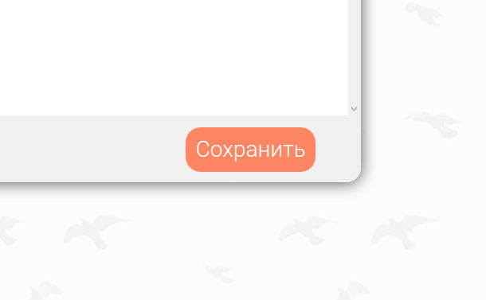

# Другофильтр

  

## Описание

Данный сервис выводит всех ваших друзей из соц.сети VK.com

Сервис разрабатывался для закрепления моих знаний в программировании на чистом Javascript, а так же для изучения API VK.com

## Как использовать

После того как приложение выведет всех ваших друзей, вам станут доступны следующие возможности:

### Во-первых

Перетаскивание друзей из правого столбца в левый и обратно при помощи мыши

### Во-вторых

Перемещение друзей из правого столбца в левый и обратно при помощи крестиков на против их имён

  

### В-третьих

Поиск друзей при помощи полей ввода

### В-четвертых

Сохранение списков друзей

## Как скачать проект

Перед тем как скачать проект убедитесь, что у вас установлены

*   [Node.js](https://nodejs.org/)
*   [NPM](https://www.npmjs.com/)
*   [Bower](http://bower.io/)
*   [Gulp](http://gulpjs.com/)

### Скачивание

В консоле перейдите в папку в которую будет скачиваться проект. После чего наберите команды

*   git clone https://github.com/AlexeyErofeyev/DrygoFilter.git
*   cd DrygoFilter
*   npm install
*   bower install
*   gulp

Проект сам запустится и откроется в браузере